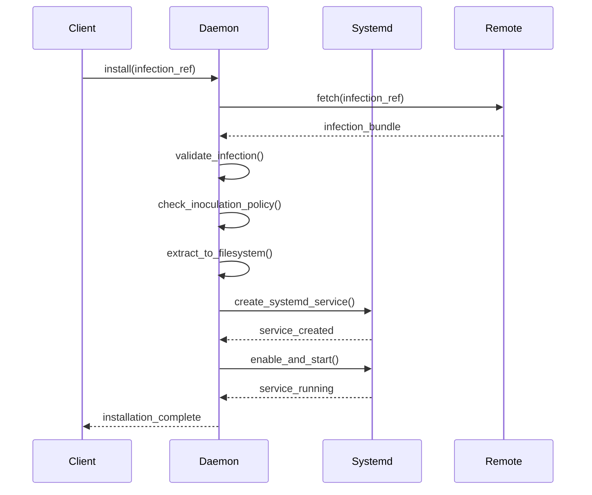
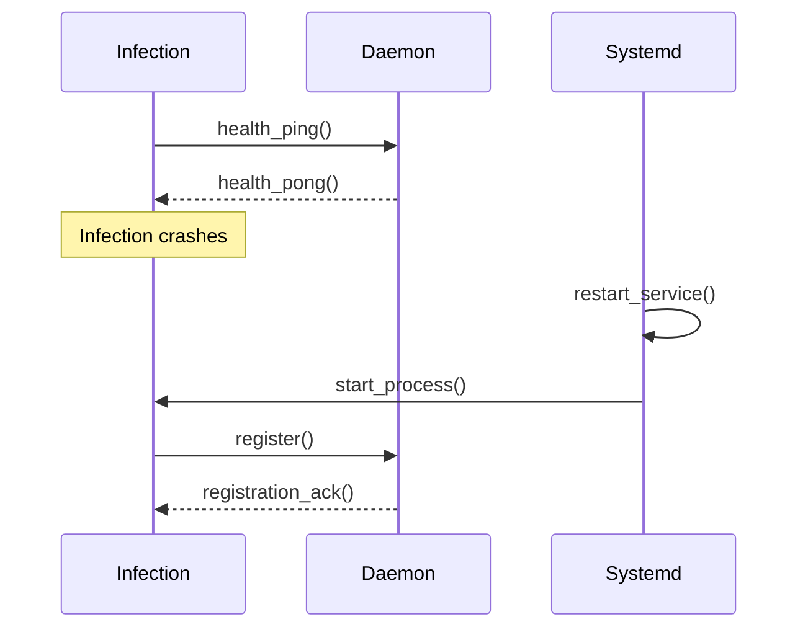

# Pandemic System Design Document

## 1. System Overview

### 1.1 Architecture Summary
Pandemic is a multi-layered edge computing daemon that uses a Unix domain socket core with systemd-managed infection plugins. The system follows a hub-and-spoke model where the core daemon coordinates infection lifecycle through local IPC.

### 1.2 Key Design Principles
- **Unix-native**: Leverages systemd for process management and journald for logging
- **Minimal core**: Lightweight daemon with plugin-based extensibility
- **Secure by default**: Process isolation via systemd User/Group settings
- **Remote-capable**: Infections can be sourced from remote repositories

## 2. System Architecture

### 2.1 Component Overview

```
┌─────────────────────────────────────────────────────────────┐
│                    Pandemic System                          │
├─────────────────────────────────────────────────────────────┤
│  pandemic-client (CLI)                                      │
│       │                                                     │
│       │ UDS                                                 │
│       ▼                                                     │
│  ┌─────────────────┐    ┌──────────────────────────────────┐│
│  │   Core Daemon   │    │        Systemd Services          ││
│  │                 │    │                                  ││
│  │ • UDS Server    │◄──►│ • infection-web.service          ││
│  │ • Config Mgmt   │    │ • infection-motion.service       ││
│  │ • Systemd API   │    │ • infection-tcp-bridge.service   ││
│  │ • State Mgmt    │    │                                  ││
│  └─────────────────┘    └──────────────────────────────────┘│
│                                                             │
│  ┌─────────────────────────────────────────────────────────┐│
│  │              Remote Sources                             ││
│  │  • GitHub repositories                                  ││
│  │  • HTTP/HTTPS endpoints                                 ││
│  │  • Local filesystem                                     ││
│  └─────────────────────────────────────────────────────────┘│
└─────────────────────────────────────────────────────────────┘
```

### 2.2 Core Components

#### 2.2.1 Core Daemon (`pandemic`)
- **Purpose**: Central coordinator and state manager
- **Communication**: Unix domain socket server (`/var/run/pandemic.sock`)
- **Responsibilities**:
  - Infection lifecycle management
  - Configuration validation
  - Systemd service orchestration
  - Inoculation policy enforcement

#### 2.2.2 Client (`pandemic-client`)
- **Purpose**: Command-line interface for system interaction
- **Communication**: Unix domain socket client
- **Responsibilities**:
  - User command processing
  - Remote infection fetching
  - Status reporting and monitoring

#### 2.2.3 Infections (Systemd Services)
- **Purpose**: Edge function execution units
- **Communication**: UDS clients to core daemon
- **Responsibilities**:
  - Specific edge function logic
  - Health reporting to core
  - Resource consumption management

## 3. Data Models

### 3.1 Infection Definition

```yaml
# infection.yaml
metadata:
  name: "motion-detector"
  version: "1.0.0"
  description: "Motion detection edge function"
  author: "user@example.com"
  
source:
  type: "github"  # github, http, local
  url: "https://github.com/user/motion-detector"
  ref: "v1.0.0"   # tag, branch, or commit
  
systemd:
  user: "pandemic-motion"
  group: "pandemic"
  working_directory: "/opt/pandemic/infections/motion-detector"
  environment:
    - "PANDEMIC_SOCKET=/var/run/pandemic.sock"
    - "LOG_LEVEL=INFO"
  
execution:
  command: "/opt/pandemic/infections/motion-detector/bin/motion-detector"
  restart: "always"
  restart_sec: 5
  
resources:
  memory_limit: "128M"
  cpu_quota: "50%"
  
inoculation:
  allowed_devices: ["edge-*", "camera-*"]
  blocked_devices: ["server-*"]
  required_capabilities: ["camera", "gpio"]
```

### 3.2 Daemon Configuration

```yaml
# /etc/pandemic/daemon.yaml
daemon:
  socket_path: "/var/run/pandemic.sock"
  socket_mode: 0660
  socket_group: "pandemic"
  pid_file: "/var/run/pandemic.pid"
  
storage:
  infections_dir: "/opt/pandemic/infections"
  config_dir: "/etc/pandemic"
  state_dir: "/var/lib/pandemic"
  
security:
  validate_signatures: true
  allowed_sources:
    - "github.com/pandemic-org/*"
    - "https://infections.pandemic.io/*"
  
logging:
  level: "INFO"
  structured: true
```

### 3.3 Inoculation Policy

```yaml
# /etc/pandemic/inoculations.yaml
device:
  id: "edge-camera-01"
  capabilities: ["camera", "gpio", "network"]
  
policies:
  - name: "block-network-intensive"
    action: "deny"
    conditions:
      resource_requirements:
        network_bandwidth: ">10Mbps"
        
  - name: "allow-motion-detection"
    action: "allow"
    conditions:
      infection_name: "motion-*"
      author: "trusted-org@example.com"
```

## 4. Communication Protocols

### 4.1 UDS Protocol (Core ↔ Client/Infections)

#### Message Format
```json
{
  "id": "uuid4-request-id",
  "type": "request|response|event",
  "command": "install|remove|status|list|health",
  "payload": {},
  "timestamp": "2024-01-01T00:00:00Z"
}
```

#### Core Commands
- `install`: Deploy new infection
- `remove`: Remove existing infection  
- `status`: Get infection status
- `list`: List all infections
- `health`: Health check ping/pong

## 4.3 Core Platform Operations

### 4.3.1 Infection Management Operations

#### `install`
**Purpose**: Deploy and start a new infection from remote or local source

**Request**:
```json
{
  "id": "req-123",
  "type": "request",
  "command": "install",
  "payload": {
    "source": "github://user/repo@v1.0.0",
    "name": "custom-name",  // optional override
    "configOverrides": {    // optional
      "environment": {
        "DEBUG": "true"
      }
    },
    "force": false  // reinstall if exists
  }
}
```

**Response**:
```json
{
  "id": "req-123",
  "type": "response",
  "status": "success|error",
  "payload": {
    "infectionId": "motion-detector-abc123",
    "serviceName": "pandemic-infection@motion-detector.service",
    "installationPath": "/opt/pandemic/infections/motion-detector"
  },
  "error": "error message if status=error"
}
```

#### `remove` (Vaccination)
**Purpose**: Stop and remove an existing infection

**Request**:
```json
{
  "id": "req-124",
  "type": "request",
  "command": "remove",
  "payload": {
    "infectionId": "motion-detector-abc123",
    "force": false,  // force removal even if running
    "cleanup": true  // remove files and config
  }
}
```

**Response**:
```json
{
  "id": "req-124",
  "type": "response",
  "status": "success|error",
  "payload": {
    "removedFiles": ["/opt/pandemic/infections/motion-detector"],
    "removedServices": ["pandemic-infection@motion-detector.service"]
  }
}
```

#### `update`
**Purpose**: Update an existing infection to a new version

**Request**:
```json
{
  "id": "req-125",
  "type": "request",
  "command": "update",
  "payload": {
    "infectionId": "motion-detector-abc123",
    "source": "github://user/repo@v2.0.0",
    "strategy": "rolling|blue_green|immediate"
  }
}
```

### 4.3.2 Status and Monitoring Operations

#### `status`
**Purpose**: Get detailed status of specific infection or daemon

**Request**:
```json
{
  "id": "req-126",
  "type": "request",
  "command": "status",
  "payload": {
    "infectionId": "motion-detector-abc123",  // optional, omit for daemon status
    "includeMetrics": true,
    "includeLogs": false
  }
}
```

**Response**:
```json
{
  "id": "req-126",
  "type": "response",
  "status": "success",
  "payload": {
    "infectionId": "motion-detector-abc123",
    "state": "running|stopped|failed|starting|stopping",
    "systemdStatus": {
      "activeState": "active",
      "subState": "running",
      "pid": 12345,
      "memoryUsage": "45.2MB",
      "cpuUsage": "12.5%",
      "uptime": "2h 15m"
    },
    "health": {
      "lastPing": "2024-01-01T12:00:00Z",
      "responseTimeMs": 15,
      "consecutiveFailures": 0
    },
    "version": "1.0.0",
    "source": "github://user/repo@v1.0.0"
  }
}
```

#### `list`
**Purpose**: List all infections with summary information

**Request**:
```json
{
  "id": "req-127",
  "type": "request",
  "command": "list",
  "payload": {
    "filter": {
      "state": "running",  // optional filter
      "namePattern": "motion-*"  // optional glob pattern
    },
    "includeMetrics": false
  }
}
```

**Response**:
```json
{
  "id": "req-127",
  "type": "response",
  "status": "success",
  "payload": {
    "infections": [
      {
        "infectionId": "motion-detector-abc123",
        "name": "motion-detector",
        "state": "running",
        "version": "1.0.0",
        "uptime": "2h 15m",
        "memoryUsage": "45.2MB"
      }
    ],
    "totalCount": 1,
    "runningCount": 1
  }
}
```

### 4.3.3 Control Operations

#### `start`
**Purpose**: Start a stopped infection

**Request**:
```json
{
  "id": "req-128",
  "type": "request",
  "command": "start",
  "payload": {
    "infectionId": "motion-detector-abc123"
  }
}
```

#### `stop`
**Purpose**: Stop a running infection

**Request**:
```json
{
  "id": "req-129",
  "type": "request",
  "command": "stop",
  "payload": {
    "infectionId": "motion-detector-abc123",
    "timeout": 30  // seconds before force kill
  }
}
```

#### `restart`
**Purpose**: Restart an infection

**Request**:
```json
{
  "id": "req-130",
  "type": "request",
  "command": "restart",
  "payload": {
    "infectionId": "motion-detector-abc123"
  }
}
```

### 4.3.4 Configuration Operations

#### `getConfig`
**Purpose**: Retrieve infection or daemon configuration

**Request**:
```json
{
  "id": "req-131",
  "type": "request",
  "command": "getConfig",
  "payload": {
    "infectionId": "motion-detector-abc123",  // omit for daemon config
    "section": "environment"  // optional specific section
  }
}
```

#### `setConfig`
**Purpose**: Update infection or daemon configuration

**Request**:
```json
{
  "id": "req-132",
  "type": "request",
  "command": "setConfig",
  "payload": {
    "infectionId": "motion-detector-abc123",
    "config": {
      "environment": {
        "DEBUG": "false",
        "LOG_LEVEL": "WARN"
      }
    },
    "restartRequired": true  // restart infection after config change
  }
}
```

### 4.3.5 Logging Operations

#### `logs`
**Purpose**: Retrieve logs for infection or daemon

**Request**:
```json
{
  "id": "req-133",
  "type": "request",
  "command": "logs",
  "payload": {
    "infectionId": "motion-detector-abc123",
    "lines": 100,  // number of lines
    "follow": false,  // stream logs
    "since": "2024-01-01T00:00:00Z",  // optional timestamp
    "level": "INFO"  // optional log level filter
  }
}
```

**Response**:
```json
{
  "id": "req-133",
  "type": "response",
  "status": "success",
  "payload": {
    "logs": [
      {
        "timestamp": "2024-01-01T12:00:00Z",
        "level": "INFO",
        "message": "Motion detected at camera 1",
        "pid": 12345
      }
    ],
    "totalLines": 1
  }
}
```

### 4.3.6 Health and Diagnostics

#### `health`
**Purpose**: Health check for daemon or specific infection

**Request**:
```json
{
  "id": "req-134",
  "type": "request",
  "command": "health",
  "payload": {
    "infectionId": "motion-detector-abc123",  // optional
    "deepCheck": true  // perform comprehensive health check
  }
}
```

#### `metrics`
**Purpose**: Get system and infection metrics

**Request**:
```json
{
  "id": "req-135",
  "type": "request",
  "command": "metrics",
  "payload": {
    "infectionId": "motion-detector-abc123",  // optional, omit for system metrics
    "timeRange": "1h",  // 1m, 5m, 1h, 24h
    "metrics": ["cpu", "memory", "network", "disk"]  // optional filter
  }
}
```

### 4.3.7 Source Management

#### `listSources`
**Purpose**: List available infection sources

**Request**:
```json
{
  "id": "req-136",
  "type": "request",
  "command": "listSources",
  "payload": {
    "sourceType": "github",  // optional filter
    "search": "motion"  // optional search term
  }
}
```

#### `validateSource`
**Purpose**: Validate infection source before installation

**Request**:
```json
{
  "id": "req-137",
  "type": "request",
  "command": "validateSource",
  "payload": {
    "source": "github://user/repo@v1.0.0",
    "checkSignature": true,
    "checkInoculation": true
  }
}
```

### 4.3.8 Event Streaming

#### `subscribe`
**Purpose**: Subscribe to real-time events

**Request**:
```json
{
  "id": "req-138",
  "type": "request",
  "command": "subscribe",
  "payload": {
    "events": ["infection.started", "infection.stopped", "infection.failed"],
    "infectionFilter": "motion-*"  // optional filter
  }
}
```

**Event Stream**:
```json
{
  "id": "event-001",
  "type": "event",
  "event": "infection.started",
  "payload": {
    "infectionId": "motion-detector-abc123",
    "timestamp": "2024-01-01T12:00:00Z"
  }
}
```

### 4.2 Systemd Integration

#### Service Template
```ini
# /etc/systemd/system/pandemic-infection@.service
[Unit]
Description=Pandemic Infection: %i
After=pandemic.service
Requires=pandemic.service
PartOf=pandemic.service

[Service]
Type=simple
User=%i-user
Group=pandemic
WorkingDirectory=/opt/pandemic/infections/%i
ExecStart=/opt/pandemic/infections/%i/bin/%i
Restart=always
RestartSec=5
StandardOutput=journal
StandardError=journal

# Resource limits from infection config
MemoryLimit=%i-memory
CPUQuota=%i-cpu

[Install]
WantedBy=pandemic.target
```

## 5. File System Layout

```
/etc/pandemic/
├── daemon.yaml              # Core daemon configuration
├── inoculations.yaml        # Device-specific policies
└── infections/              # Infection definitions
    ├── motion-detector.yaml
    └── web-server.yaml

/opt/pandemic/
└── infections/              # Installed infection code
    ├── motion-detector/
    │   ├── bin/motion-detector
    │   ├── lib/
    │   └── config/
    └── web-server/
        ├── bin/web-server
        └── static/

/var/lib/pandemic/
├── state.yaml              # Runtime state
├── infections.db           # Infection registry
└── logs/                   # Archived logs

/var/run/
├── pandemic.sock           # UDS socket
└── pandemic.pid            # Daemon PID
```

## 6. Process Flow

### 6.1 Infection Installation



### 6.2 Infection Communication



## 7. Security Model

### 7.1 Process Isolation
- Each infection runs as dedicated systemd service
- Unique user/group per infection (`pandemic-{infection}`)
- Resource limits enforced by systemd
- Working directory isolation

### 7.2 Communication Security
- UDS socket with group permissions (0660)
- Client authentication via socket credentials
- Message validation and sanitization

### 7.3 Code Validation
- Optional signature verification for remote sources
- Source allowlist/blocklist
- Inoculation policies for device-specific restrictions

## 8. Remote Source Handlers

### 8.1 GitHub Handler
```python
class GitHubSource:
    def fetch(self, url: str, ref: str) -> InfectionBundle:
        # Clone repository at specific ref
        # Validate infection.yaml exists
        # Return bundle with code + metadata
```

### 8.2 HTTP Handler  
```python
class HTTPSource:
    def fetch(self, url: str) -> InfectionBundle:
        # Download tarball/zip
        # Extract and validate structure
        # Return bundle
```

### 8.3 Local Handler
```python
class LocalSource:
    def fetch(self, path: str) -> InfectionBundle:
        # Copy from local filesystem
        # Validate structure
        # Return bundle
```

## 9. Error Handling

### 9.1 Infection Failures
- Systemd automatic restart with exponential backoff
- Health check failures trigger restart
- Persistent failures mark infection as "degraded"
- Vaccination (removal) after max failure threshold

### 9.2 Daemon Failures
- Systemd manages daemon lifecycle
- State persistence allows recovery
- Graceful shutdown with infection cleanup
- Socket cleanup on restart

### 9.3 Network Failures
- Retry logic for remote source fetching
- Cached infections for offline operation
- Graceful degradation when sources unavailable

## 10. Monitoring and Observability

### 10.1 Logging Strategy
- Structured JSON logging to stdout (journald)
- Per-infection log streams via systemd
- Centralized correlation via request IDs
- Log levels: DEBUG, INFO, WARN, ERROR

### 10.2 Metrics Collection
- Infection resource usage via systemd
- UDS connection metrics
- Installation success/failure rates
- Health check response times

### 10.3 Health Checks
- Daemon health via UDS ping/pong
- Infection health via periodic checks
- Systemd service status monitoring
- Resource threshold alerting

## 11. Deployment Considerations

### 11.1 Installation
```bash
# System setup
sudo useradd -r -s /bin/false pandemic
sudo mkdir -p /etc/pandemic /opt/pandemic /var/lib/pandemic
sudo systemctl enable pandemic.service

# Package installation
pip install pandemic
pandemic --setup-system
```

### 11.2 Configuration Management
- YAML-based configuration files
- Environment variable overrides
- Runtime configuration updates via UDS
- Configuration validation on startup

### 11.3 Upgrade Strategy
- Rolling updates via systemd service restart
- Infection versioning and rollback support
- Configuration migration scripts
- Backward compatibility guarantees

## 12. Future Extensions

### 12.1 Network Bridge Infection
- TCP socket server infection
- Proxies UDS to network clients
- Authentication and authorization layer
- Rate limiting and connection management

### 12.2 Web Management Interface
- REST API infection for HTTP management
- Real-time status dashboard
- Infection marketplace integration
- Remote device management

### 12.3 Distributed Coordination
- Multi-node infection synchronization
- Distributed state management
- Load balancing across devices
- Centralized monitoring and control